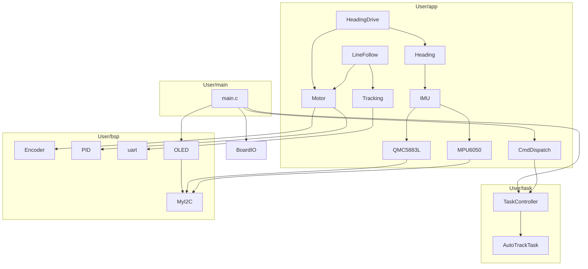

# 分层架构重构记录

> 日期：2026-07-08

---

## 一、目录重构

### 1.1 新目录结构

```
msp_car/
├── empty.syscfg                    ← TI SysConfig，不动
├── User/                           ← ★ 所有用户代码
│   ├── systool/                    ← 纯软件工具
│   │   ├── PID.c / PID.h
│   │   └── delay.c / delay.h
│   │
│   ├── bsp/                        ← 硬件抽象层
│   │   ├── Bluetooth.c/h    ├── BoardIO.c/h
│   │   ├── Encoder.c/h      ├── Motor.c/h
│   │   ├── MPU6050.c/h/_Reg.h  ├── MyI2C.c/h
│   │   ├── OLED.c/h/_Font.h ├── QMC5883L.c/h
│   │   ├── Serial.h         ├── Timer.c/h
│   │   ├── Tracking.c/h     ├── uart.c/h
│   │
│   ├── app/                        ← 应用集成层
│   │   ├── CmdDispatch.c/h  ├── Heading.c/h
│   │   ├── HeadingDrive.c/h ├── IMU.c/h
│   │   ├── IMUTest.c/h      ├── LineFollow.c/h
│   │
│   ├── task/                       ← 运行模式
│   │   ├── TaskController.c/h  ← ★ 新增
│   │   └── AutoTrackTask.c/h
│   │
│   └── main/                       ← 程序入口
│       └── main.c                  ← 原 empty.c
│
├── Debug/                          ← CCS 构建输出
│   ├── makefile        ← ORDERED_OBJS 更新
│   ├── subdir_rules.mk ← include 路径指向 User/
│   ├── app/    subdir_rules.mk + subdir_vars.mk
│   ├── bsp/    subdir_rules.mk + subdir_vars.mk
│   ├── system/ subdir_rules.mk + subdir_vars.mk  (源→User/systool/)
│   └── task/   subdir_rules.mk + subdir_vars.mk
│
└── docs/
```

### 1.2 分层依赖关系



### 1.3 层级职责

| 层 | 职责 | 允许依赖 | 禁止 |
|:---|:---|:---|:---|
| **systool** | 纯算法/工具函数 | 无 | 不碰寄存器、外设 |
| **bsp** | 单一外设寄存器操作 | systool | 不跨外设调用 |
| **app** | 组合 bsp 提供功能接口 | bsp, systool | 不直接操作寄存器，不含模式决策 |
| **task** | 运行模式 FSM/流程 | app | 不直接操作寄存器、底层算法 |
| **main** | 初始化、主循环、人机交互 | 所有层 | 不写业务逻辑 |

---

## 二、构建脚本变更

### 2.1 编译器 Include 路径

所有 `subdir_rules.mk` 中新增：

```
-I".../msp_car/User/app"
-I".../msp_car/User/bsp"
-I".../msp_car/User/systool"
-I".../msp_car/User/task"
-I".../msp_car/User/main"
```

### 2.2 源文件路径映射

| 构建输出 | 旧源路径 | 新源路径 |
|:---|:---|:---|
| `Debug/app/*.o` | `../app/*.c` | `../User/app/*.c` |
| `Debug/bsp/*.o` | `../bsp/*.c` | `../User/bsp/*.c` |
| `Debug/system/*.o` | `../system/*.c` | `../User/systool/*.c` |
| `Debug/task/*.o` | `../task/*.c` | `../User/task/*.c` |

### 2.3 ORDERED_OBJS 变更

| 旧 | 新 |
|:---|:---|
| `./app/empty.o` | `./app/main.o` |
| `./task/RaceMaster.o`, `./task/Task_AutoTrack.o` | `./task/AutoTrackTask.o`, `./task/TaskController.o` |
| _(无)_ | +`./app/IMU.o`, `./bsp/BoardIO.o` |

### 2.4 `app/subdir_rules.mk` 特殊处理

`main.c` 位于 `User/main/` 而非 `User/app/`，添加了显式规则：

```makefile
app/main.o: ../User/main/main.c $(GEN_OPTS) | $(GEN_FILES) $(GEN_MISC_FILES)
	@echo 'Building file: "$<"'
	...
```

---

## 三、TaskController 设计

### 3.1 公开接口

```c
// 模式枚举
typedef enum {
    TASK_MODE_IDLE       = 0,
    TASK_MODE_AUTO_TRACK = 1,
    TASK_MODE_COUNT
} TaskMode;

// 主循环调用
void  TaskController_Init(void);
void  TaskController_Start(TaskMode mode);
void  TaskController_Stop(void);
void  TaskController_Update(float dt_sec);

// 状态查询
TaskMode    TaskController_GetMode(void);
uint8_t     TaskController_IsRunning(void);
const char* TaskController_GetModeText(void);
const char* TaskController_GetStateText(void);
```

### 3.2 当前实现（仅 IDLE + AUTO_TRACK）

- **TASK_MODE_IDLE**: `Update()` 为空，所有手动命令（t/l/r/h/f/o）正常工作
- **TASK_MODE_AUTO_TRACK**: 委托 `AutoTrackTask_Start/Stop/Update`
- 自动检测：巡迹完成或出错后，`TaskController_Update` 自动回 IDLE

### 3.3 未来扩展点

| 模式 | 用途 | 对应题目 |
|:---|:---|:---|
| `TASK_MODE_TARGET_AIM` | 定点瞄准 | 基本2 |
| `TASK_MODE_TRACK_AND_AIM` | 巡迹+靶位联动（串行编排） | 基本3 |
| `TASK_MODE_DYNAMIC_TRACK` | 动态跟随（并行驱动） | 发挥1 |
| `TASK_MODE_TARGET_DRAW` | 同步绘制 | 发挥2 |
| `TASK_MODE_MULTI_LAP` | 四圈连续 | 发挥3 |

---

## 四、AutoTrackTask 变更

### 4.1 新增状态

```c
#define AUTO_TRACK_STATE_PAUSED_B  8U
#define AUTO_TRACK_STATE_PAUSED_C  9U
#define AUTO_TRACK_STATE_PAUSED_D 10U
```

### 4.2 新增接口

```c
void  AutoTrackTask_SetCheckpointMode(uint8_t enable);  // 开启/关闭检查点暂停
void  AutoTrackTask_Resume(void);                       // 从暂停恢复
const char* AutoTrackTask_GetStateText(void);            // 获取状态文本
```

### 4.3 暂停逻辑

当 `checkpoint_mode = 1` 时，三个检查点会停车等待：

| 点 | 触发条件 | 暂停状态 | Resume 后进入 |
|:---|:---|:---|:---|
| B | STRAIGHT_AB 检测到黑线 | PAUSED_B | FOLLOW_BC |
| C | FOLLOW_BC 检测到白区 | PAUSED_C | STRAIGHT_CD |
| D | STRAIGHT_CD 检测到黑线 | PAUSED_D | FOLLOW_DA |

暂停时：车停止运动，不累加 tick，不响警报。

`checkpoint_mode = 0`（默认）：原行为，直接通过所有检查点。

---

## 五、CmdDispatch 变更

### 5.1 新增模式命令

| 命令 | 效果 |
|:---|:---|
| `A0` | 切换到 `TASK_MODE_IDLE`，停止任何运行中的自动模式 |
| `A1` | 切换到 `TASK_MODE_AUTO_TRACK`，启动自动巡迹 |

### 5.2 手动命令锁定

当 `TaskController_IsRunning() == 1` 时，以下命令被拒绝并返回 `BUSY`：

- `Parse_TuneLine`: t/l/r/h/o/p/i/d/q/w/e（除 `a` 外的所有行命令）
- `Dispatch_Immediate`: 0/1/s/f（停止/启动/巡线开关）

以下状态查询命令在自动模式中仍可用：`? v x X y Y C M m`

---

## 六、main.c 变更

### 6.1 初始化

```c
// 旧:
AutoTrackTask_Init();

// 新:
TaskController_Init();  // 内部调用 AutoTrackTask_Init()
```

### 6.2 按键逻辑

```c
// 旧:
if (AutoTrackTask_IsActive() || AutoTrackTask_IsRunning())
    AutoTrackTask_Stop();
else
    AutoTrackTask_Start();

// 新:
if (TaskController_IsRunning())
    TaskController_Stop();
else
    TaskController_Start(TASK_MODE_AUTO_TRACK);
```

### 6.3 主循环任务调度

```c
// 旧:
if (AutoTrackTask_IsActive()) {
    AutoTrackTask_Update(dt);
} else if (...其他手动模式...) { ... }

// 新:
if (TaskController_IsRunning()) {
    TaskController_Update(dt);
} else if (...手动模式...) { ... }
```

### 6.4 状态文本迁移

`Task1_StateText()` 函数从 `main.c` 迁移到 `AutoTrackTask.c` → `AutoTrackTask_GetStateText()`。

---

## 七、main.c 瘦身：Display / StreamOutput / 流节拍迁移

### 7.1 动机

第一版重构后 `main.c` 仍有 ~475 行，其中近一半是 OLED 页面渲染和串口流节拍管理，与程序入口职责不符。

### 7.2 拆分策略

| 内容 | 迁往 | 行数 |
|:---|:---|:--|
| OLED 6 个页面渲染 + 布局缓存 | `User/app/Display.c/h` | ~290 |
| VOFA 速度流 / IMU 流打印 | `User/app/StreamOutput.c/h` | ~45 |
| IR/IMU/MagCal/速度流节拍 tick 管理 | `CmdDispatch_UpdateStreams()` | +55 |

### 7.3 新增文件

#### `User/app/Display.h`

```c
void Display_Init(uint8_t oled_ok);
void Display_NextPage(void);
void Display_Function(void);
void Display_Update(void);   // 每 100ms 调用，内部自管 tick
```

封装了 6 个 OLED 页面：SPEED / ANGLE / BUZZER / LED / ADC(Task1) / IMU_CAL。每页有独立的 layout 缓存，只刷新变化的数据。

#### `User/app/StreamOutput.h`

```c
void StreamOutput_PrintVofa(void);   // SPD,AL,AR,PL,PR
void StreamOutput_PrintImu(void);    // IMU,ok,ax,ay,az,...yaw
```

从 `main.c` 底部抽出的两个打印函数，根据 `g_StreamTarget` 自动选择 Bluetooth 或 Serial 输出。

#### `CmdDispatch_UpdateStreams()`（追加在 `CmdDispatch.c`）

```c
void CmdDispatch_UpdateStreams(void);
```

将主循环中 4 个流（IR / IMU / MagCal / VOFA）的 tick 累加 + 阈值判断 + 打印逻辑集中管理。内部使用 `static` 局部 tick 计数器，不再污染 main 的作用域。

### 7.4 main.c 精简对比

| 指标 | 迁移前 | 迁移后 |
|:---|:--|:--|
| 总行数 | ~475 | **85** |
| 函数定义 | 18 个 | **1** 个 (`main`) |
| 静态变量 | `display_layout`, `app_oled_page`, `oled_tick`, `speed_cache`, `imu_cache`, `ir_stream_tick`, `imu_stream_tick`, `mag_cal_stream_tick`, `speed_stream_tick` | **0** |

```c
// ── 主循环对比 ──

// 迁移前 (~70 行节拍管理)
while (1) {
    CmdDispatch_Process();
    if (g_SampleReady) {
        // ... 读 tick, 按键, 任务调度 ...
        // IR 流节拍 (8行)
        // IMU 流节拍 (8行)
        // MagCal 流节拍 (8行)
        // IMU 特殊流 (3行)
        // OLED tick + 页面刷新 (12行)
        // VOFA 速度流 (8行)
    }
}

// 迁移后 (~20 行节拍管理)
while (1) {
    CmdDispatch_Process();
    if (g_SampleReady) {
        // ... 读 tick, 按键, 任务调度 (不变) ...
        CmdDispatch_UpdateStreams();   // 一行替代 ③d/e/f/g/i
        Display_Update();              // 一行替代 ③h
    }
}
```

---

## 八、编译结果（第二版）

- **输出文件**: `Debug/02_2UART.out`
- **链接的目标文件**:

| 目录 | 文件 |
|:---|:---|
| `app/` | `CmdDispatch.o`, **`Display.o`**, `Heading.o`, `HeadingDrive.o`, `IMU.o`, `IMUTest.o`, `LineFollow.o`, **`StreamOutput.o`**, `main.o` |
| `bsp/` | `Bluetooth.o`, `BoardIO.o`, `Encoder.o`, `MPU6050.o`, `Motor.o`, `MyI2C.o`, `OLED.o`, `QMC5883L.o`, `Timer.o`, `Tracking.o`, `uart.o` |
| `system/` | `PID.o`, `delay.o` |
| `task/` | `AutoTrackTask.o`, `TaskController.o` |

> **新增 2 个 .o 文件**: `Display.o`, `StreamOutput.o`

---

## 九、后续待办

- [ ] 验证下地实测 `A1` 命令和按键启动自动巡迹
- [ ] 验证 `A0` 急停 + 蜂鸣器/LED 正确关闭
- [ ] 验证手动命令（t/l/r/h/f）在 IDLE 模式正常、在 AUTO_TRACK 模式被拒绝
- [ ] 验证 OLED 6 个页面翻页和数据显示正常
- [ ] 后续实现 `TASK_MODE_TRACK_AND_AIM`（需要云台驱动）
- [ ] 后续实现 `TASK_MODE_DYNAMIC_TRACK`
- [ ] 后续实现 `TASK_MODE_MULTI_LAP`
