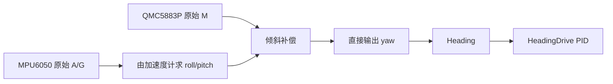
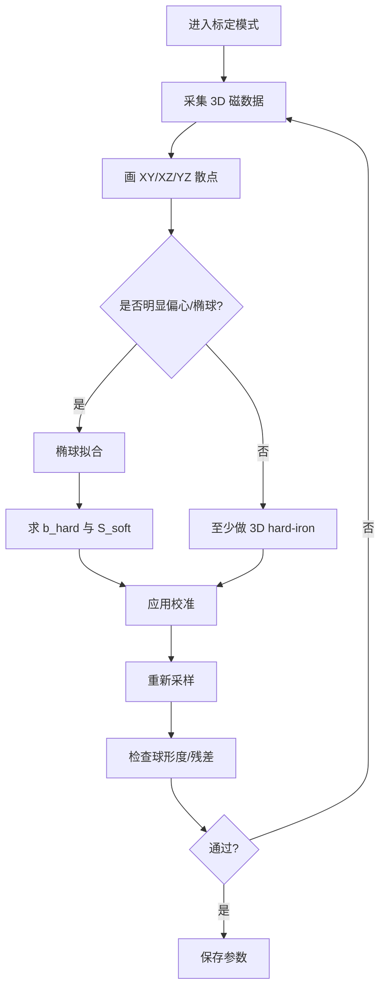
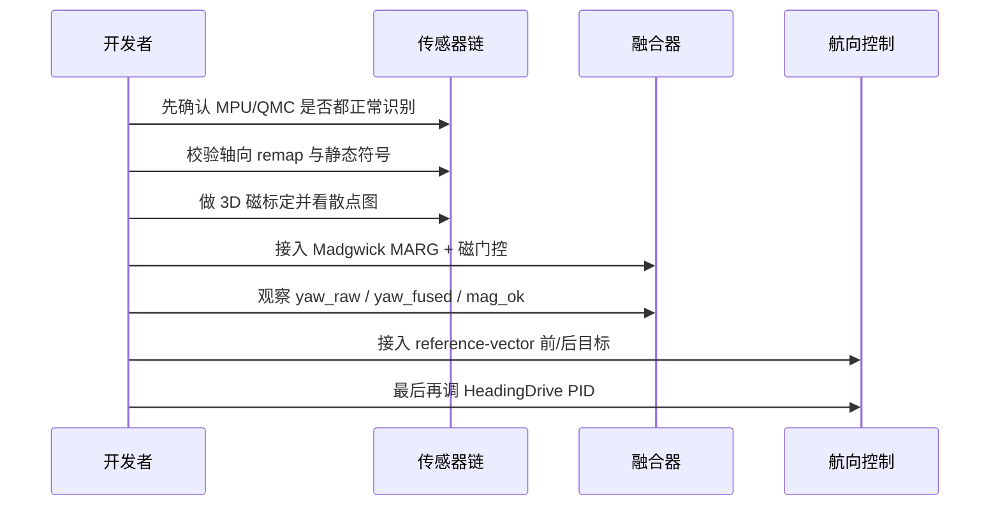

# 02_2UART 智能小车航向角偏移问题深度分析报告

## 执行摘要

对 `Lcxzyt/02_2UART` 仓库逐文件审阅后，可以较明确地判断：当前工程中“航向角偏移”“参考方向场不稳定”“来/回方向不能稳定保持精确 180°”的主因，不是单一的寄存器配置错误，而是**整条航向估计链路在设计上仍停留在“加速度计求俯仰/横滚 + 磁力计直接倾斜补偿求 yaw”**，且**没有做完整的磁力计软铁补偿、没有做车体坐标系与传感器坐标系对齐、没有做磁干扰门控、没有把陀螺仪真正融合进 yaw**。仓库虽然在 `IMU.c` 中实现了 1D Kalman 接口，但实际输出路径 `IMUTest_Read()` 调用的是 `IMU_GetAttitudeRaw()`，不是融合后的姿态接口；即使调用了现有的 `IMU_GetAttitudeKF()`，它也只对 roll / pitch 做 Kalman，yaw 仍然直接来自磁力计，因此不能解决磁干扰和基准漂移问题。仓库当前的自动磁校准也只做了**硬铁偏置**，并且验收条件主要看 XY 半径与比例，未完成 3D 软铁椭球校正。以上问题都能直接解释“小车来/回角度差不是稳定 180°、方向指向会飘”的现象。 citeturn43view0turn43view1turn46view2turn46view3turn24view1turn42view0turn39view0

本报告给出的修正方案分为两层。第一层是**必须立刻修正**的工程问题：统一确认磁力计为 QMC5883P 还是其他兼容器件；把 QMC5883P 地址固定为官方默认 `0x2C` 并明确寄存器 `0x29/0x0B/0x0A` 的配置；增加传感器轴向重映射；把磁力计校准从“仅硬铁”升级到“硬铁 + 软铁 3D 椭球拟合”；增加磁场模长和航向创新量门控。第二层是**决定最终能否达到目标指标**的算法层修正：将当前 yaw 输出替换为**Madgwick MARG 四元数融合**或同等级的 Mahony/MARG 实现，并用“**参考方向向量法**”而不是“每次分别记录正向和反向角度”的方式输出前进/后退目标角。这样可以使“回程角”天然等于“去程角 + 180°”，从数学上避免因为重新测一次磁航向而造成的偏差；同时通过磁门控和参考向量冻结，使“参考方向场”在短时磁扰动下保持稳定。 citeturn36view3turn35view0turn35view4turn39view0turn39view2turn31view4turn31view5

需要特别说明的是，工程上可以把“参考方向场始终稳定不偏移”做到**在正常地磁环境、已完成标定、并能检测/拒绝局部磁扰动时稳定**，但如果传感器紧邻电机、强电流线、铁磁螺丝、底盘钢件，且不做布局整改或门控冻结，那么任何纯磁航向系统都无法对“外部磁场突变”作出绝对保证。NXP 的 eCompass 说明和 QMC5883P 数据手册都强调，航向精度依赖于对硬铁/软铁误差以及姿态倾斜的正确补偿；QMC5883P 本身给出的是在合适条件下约 1°–2° 的航向精度能力，而不是在强磁扰环境下的保证值。 citeturn42view0turn45search0turn33view0

## 工程边界与已知前提

### 已明确项与未指定项

| 项目 | 结论 | 依据 |
|---|---|---|
| MCU / 平台 | **MSPM0 平台**，README 明示为 **LP-MSPM0G3507 LaunchPad** 路线 | citeturn8view3turn19view4 |
| 代码风格 | C + TI DriverLib 风格，仓库 `main.c` / `ti_msp_dl_config.h` / `MyI2C.c` 一致 | citeturn19view4turn28view2 |
| 轮速编码器 | **存在**，主程序初始化 `Encoder_Init()`，README 也写明支持编码器闭环和电机 PID | citeturn19view4turn8view3 |
| 主控制周期 | 小车主循环按 `g_SampleTicks * 0.020f` 更新，航向驱动缺省 20 ms | citeturn19view4turn11view8 |
| MPU6050 现配置 | `SMPLRT_DIV=0x07`、`CONFIG=0x06`、`GYRO_CONFIG=0x18`、`ACCEL_CONFIG=0x00`，即 DLPF 开启、约 125 Hz 采样、陀螺仪 ±2000 dps、加速度计 ±2 g | citeturn27view0turn37search0turn38search1 |
| 磁力计型号 | **README / 用户目标写 QMC5883P；代码文件名写 QMC5883L；实际器件存在命名冲突，视为“待最终核实”** | citeturn33view0turn26view0turn18view0 |
| QMC 现配置 | `CR2=RNG_8G | SETRST_ON`，`CR1=OSR2=1, OSR1=8, ODR=200Hz, MODE=CONTINUOUS` | citeturn11view2turn26view0turn35view0 |
| QMC 官方默认地址 | **QMC5883P 默认 7-bit 地址为 `0x2C`** | citeturn36view3 |
| 传感器安装朝向 | **未指定** | 仓库未给出安装示意或轴向定义，且代码中未见显式 remap。citeturn46view5turn42view0 |
| 是否允许改硬件布局 | **未指定** | 用户需求未限定 |
| 是否允许持久化标定参数到 Flash | **未指定** | 仓库中未见明确的非易失存储路径 |
| 实车磁环境 | **未指定**，但作为小车，电机、电源线、底盘铁件极可能构成局部磁扰 | 属于工程推断，需实测验证 |

### 这次审查的关键判断边界

本次判断基于三类证据叠加：一是仓库主分支代码与 README；二是 QMC5883P 官方数据手册与 NXP eCompass 应用笔记；三是 Madgwick 原始技术报告及其公开实现脉络。结论重点放在“什么会引起航向角偏移”和“怎样的输出方法能在工程上稳定实现前后方向精确 180°”。其中，**是否真的使用 QMC5883P 正品、是否存在磁场强扰、传感器是否距离电机过近**，需要结合实物板卡再做最终确认。 citeturn33view0turn42view0turn39view0turn5view1

## 仓库代码审阅与问题定位

### 结论总览

仓库并非完全没有姿态解算基础。`IMU.c` 已经提供了原始倾斜补偿航向、1D Kalman、互补滤波以及 `IMU_GetAttitudeKF()` 这类接口；`HeadingDrive.c` 也正确使用了 `Heading_AngleDiffDeg()` 做角差归一化。然而，这一套能力**没有真正接入最终航向输出链**。当前 `Heading_UpdateWithDt()` 通过 `IMUTest_Read()` 获取的 yaw，本质仍是 `IMU_GetAttitudeRaw()` 的直接磁航向值；因此只要磁环境变化，`HeadingDrive` 的闭环目标就会跟着漂。 citeturn12view0turn43view0turn46view2turn46view3turn20view2

### 可能导致偏移的代码位置

| 文件 | 函数 | 行号 | 问题描述 | 严重性 |
|---|---|---:|---|---|
| `User/app/IMUTest.c` | `IMUTest_Read` | 816–838 | 最终输出路径调用 **`IMU_GetAttitudeRaw()`**，没有使用融合接口；yaw 完全是“倾斜补偿磁航向”，陀螺仪未参与 yaw 融合。 | **严重** citeturn43view0turn43view1 |
| `User/app/IMU.c` | `IMU_GetAttitudeKF` | 1850 起 | 仓库虽然实现了 Kalman 接口，但只融合 roll / pitch，yaw 仍由 `IMU_ComputeHeading()` 直接给出，因此即便切过去也不能根治磁偏移。 | **严重** citeturn46view3turn19view0 |
| `User/app/IMU.c` | `IMU_ReadScaled` / `IMU_AccelToAngles` / `IMU_ComputeHeading` | 1509–1634 | 代码直接以 `AccelX/Y/Z`、`MagX/Y/Z` 进入姿态公式，**没有任何板级轴向重映射或符号翻转层**；若传感器封装朝向与车体坐标不完全一致，倾斜补偿和 yaw 符号都会错。NXP 明确要求先完成坐标系对齐。 | **严重** citeturn46view5turn42view0 |
| `User/app/IMUTest.c` | `IMUTest_SetMagCalibration` / `IMUTest_GetMagCalibration` | 771–812 | 形参里有 `scaleX/Y/Z`，但实际全部 `(void)` 丢弃，只保留偏置；这意味着**只有硬铁补偿，没有软铁补偿**。 | **严重** citeturn43view2turn43view3 |
| `User/app/CmdDispatch.c` | `CmdDispatch_FinishMagAutoCal` | 2585–2667 | 自动磁校准只用 `Max/Min` 求中心，并以 XY 半径和比例做验收；虽然记录了 Z，但**没有做 3D 椭球拟合，也没有把软铁矩阵写入系统**。 | **严重** citeturn24view1turn24view4turn45search0 |
| `User/app/Heading.c` | `Heading_UpdateWithDt` | 543–548 附近 | 该层每次直接取 `imu.YawDeg` 作为当前航向；注释还写明“不再需要 snap，因为每帧都会刷新磁力计 yaw”，说明参考基准也跟着原始磁航向走。 | **高** citeturn11view7turn12view0 |
| `User/bsp/QMC5883L.c` | `QMC5883L_Init` | 500–543 | 驱动未配置 **寄存器 0x29 的轴定义/符号**，而 QMC5883P 官方示例明确先写 `29H=0x06`；若模组内部轴定义与系统假设不一致，会导致航向偏转或镜像。 | **高** citeturn11view2turn35view5turn35view6 |
| `User/app/IMU.c` | `MAG_SCALE` | 文件开头 / 标度定义 | 代码把磁力计标度写成 `100/3000` μT/LSB；若目标器件确为 QMC5883P 且量程为 ±8G，官方灵敏度应为 **3750 LSB/G**，对应约 `100/3750` μT/LSB。 | **中** citeturn17view0turn35view1 |
| `User/app/IMU.c` | `IMU_Init` | 1289 起 | 磁力计地址以 `0x0D` 为默认，并扫描 `0x0D/0x1A/0x2C`；而 QMC5883P 官方默认 7-bit 地址是 `0x2C`。这暴露出 **QMC5883P/QMC5883L/移植版本混用** 的风险。 | **高** citeturn15view0turn18view0turn36view3 |
| `User/bsp/QMC5883L.c` | `QMC5883L_GetData` | 570–590 | 字节序本身与官方寄存器顺序一致，并非主因；但读取前未在上层结合 `DRDY/OVFL` 做有效性门控，无法拒绝溢出或受扰样本。 | **中** citeturn15view11turn35view4 |
| `User/bsp/MyI2C.c` | `MyI2C_ReadRegs` | 644–710 | I²C 实现采用“先写寄存器地址、再 repeated start 读”的标准流程，**整体看是正确的**，不是首要问题。 | **低** citeturn28view0turn36view4 |
| `User/app/StreamOutput.c` / `CmdDispatch.c` | `StreamOutput_PrintImu` / IMU 流输出 | 376–410；2925–2963 | 日志里只有原始 A/G/M 与欧拉角，没有输出磁场模长、磁扰标志、融合 yaw、连续 yaw、参考向量等关键信号，调试闭环不足。 | **中** citeturn30view2turn31view2 |

### 这张问题表背后的核心逻辑

最关键的三个问题实际上互相叠加。第一，**现网输出的 yaw 不是融合航向**，而是直接磁航向。第二，**磁校准只有硬铁偏置，没有软铁矩阵**，所以磁场圆不会真正回到圆，而仍然是偏心椭圆。第三，**坐标系映射层缺失**，即便寄存器和公式都对，只要板子安装方向和算法假设不一致，倾斜补偿就会出现系统性偏角。把这三件事叠加到一个会运动、有电机电流、有车体铁件的小车上，结果就是：静态看似能转，动态就飘；去程和回程各自都“看起来还行”，但两者并不能严格差 180°。 citeturn43view0turn43view2turn46view5turn42view0turn45search0

## 寄存器配置与驱动修正

### MPU6050 当前实现与建议

仓库当前对 MPU6050 的初始化是：复位后写 `SMPLRT_DIV=0x07`、`CONFIG=0x06`、`GYRO_CONFIG=0x18`、`ACCEL_CONFIG=0x00`，并打开 bypass。结合 MPU-6050 官方寄存器说明，这意味着在 DLPF 启用时以 1 kHz 陀螺输出为基准，采样率大约为 `1000 / (1 + 7) = 125 Hz`，陀螺仪量程为 ±2000 dps、加速度计量程为 ±2 g。字节拼接顺序按高字节在前读取 14 字节，和寄存器定义一致。也就是说，**MPU6050 驱动本身没有明显的字节序错误**；它的问题更偏向“参数选择偏保守/偏大”，不是航向偏移的根因。 citeturn27view0turn15view10turn37search0turn38search1

对于地面小车，角速度通常远低于手持设备或飞控系统，因此将陀螺仪长期工作在 ±2000 dps 会牺牲低速分辨率。更合理的做法通常是切到 ±500 dps 或 ±1000 dps，再把 DLPF 设在 20–42 Hz 左右，以抑制机械振动和轮系噪声。这个建议属于基于小车动态带宽的工程推断：官方文档给出了这些可配置选项，而仓库当前使用的是最大陀螺量程。 citeturn27view0turn37search0turn38search1

**建议的 MPU6050 配置**如下表。

| 寄存器 | 仓库当前 | 建议值 | 说明 |
|---|---:|---:|---|
| `PWR_MGMT_1` | `0x00` | `0x01` 或保持 `0x00` | 若实测无问题可先不改；若要提高时钟稳定性可改用 PLL 参考时钟（工程建议） |
| `SMPLRT_DIV` | `0x07` | `0x07` 或 `0x04` | 保持 125 Hz 足够；若想提高融合频率可到 200 Hz 左右 |
| `CONFIG` | `0x06` | `0x03` 或 `0x04` | 当前 5 Hz 低通偏低，转向响应会偏钝；20–42 Hz更适合小车 |
| `GYRO_CONFIG` | `0x18` | `0x08` 或 `0x10` | 推荐 ±500/±1000 dps，提高低角速度分辨率 |
| `ACCEL_CONFIG` | `0x00` | `0x00` | ±2 g 适合地面车 |
| `INT_PIN_CFG` | `0x02` | `0x02` | 保持 bypass，便于外接磁力计 |

下面给出一段与仓库风格一致的修正代码片段，重点是把 DLPF 和陀螺量程调到更适合小车的档位：

```c
uint8_t MPU6050_Init(void)
{
    uint8_t id = 0U;

    (void)MPU6050_WriteReg(MPU6050_PWR_MGMT_1, 0x80U);   // reset
    Delay_ms(100U);

    // 可选：0x01 使用 X gyro PLL；若不放心可先保持 0x00
    (void)MPU6050_WriteReg(MPU6050_PWR_MGMT_1, 0x01U);
    Delay_ms(20U);

    if (!MPU6050_ReadReg(MPU6050_WHO_AM_I, &id)) {
        return 0U;
    }
    if ((id != 0x68U) && (id != 0x72U)) {
        return 0U;
    }

    // DLPF enabled => gyro output rate = 1kHz
    // 1kHz / (1 + 7) = 125Hz
    (void)MPU6050_WriteReg(MPU6050_SMPLRT_DIV, 0x07U);

    // DLPF_CFG = 3 -> ~44/42Hz；地面车通常比 5Hz 更合适
    (void)MPU6050_WriteReg(MPU6050_CONFIG, 0x03U);

    // FS_SEL = 1 -> ±500dps；若转向较快可改 0x10U (±1000dps)
    (void)MPU6050_WriteReg(MPU6050_GYRO_CONFIG, 0x08U);

    // AFS_SEL = 0 -> ±2g
    (void)MPU6050_WriteReg(MPU6050_ACCEL_CONFIG, 0x00U);

    (void)MPU6050_WriteReg(MPU6050_PWR_MGMT_2, 0x00U);
    (void)MPU6050_WriteReg(MPU6050_INT_ENABLE, 0x00U);
    (void)MPU6050_WriteReg(MPU6050_USER_CTRL, 0x00U);
    (void)MPU6050_WriteReg(MPU6050_INT_PIN_CFG, 0x02U);  // bypass on
    Delay_ms(20U);

    return id;
}
```

上面的修改不会直接“发明出”稳定航向，但它会显著改善陀螺仪在低速转向中的可用性，为后续 MARG 融合打基础。 citeturn27view0turn37search0turn38search1

### QMC5883P 当前实现与建议

QMC5883P 官方文档给出了非常清晰的寄存器布局：`00H` 是 `CHIPID`，`01H~06H` 是 XYZ 输出，`09H` 是状态寄存器，`0AH` 是 `OSR2/OSR1/ODR/MODE`，`0BH` 是 `SOFT_RST/SELF_TEST/RNG/SET-RESET MODE`；官方默认 7-bit I²C 地址是 `0x2C`。仓库当前 `QMC5883L.h/.c` 的寄存器地址与数据字节顺序整体上是对得上的，其中 `QMC5883L_GetData()` 按 LSB/MSB 拼接也符合官方寄存器定义，因此**数据读取的字节序不是问题主因**。 citeturn26view0turn15view11turn35view4turn36view3

真正的问题有三个。其一，驱动命名、默认地址与扫描候选值混杂了 `0x0D / 0x1A / 0x2C`，而 QMC5883P 官方默认地址是 `0x2C`。其二，官方应用示例在进入正常/连续模式前会先写 **寄存器 `29H = 0x06`** 以定义 XYZ 轴号/符号，但仓库头文件中根本没有这个寄存器宏，初始化也完全没写。这意味着如果传感器模组内部坐标与算法假定不一致，yaw 方向会出现固定偏角、翻转或回程不对称。其三，仓库虽有 `DRDY` 和 `OVFL` 宏，但上层输出路径没有根据状态寄存器做有效性门控。 citeturn18view0turn11view2turn26view0turn35view5turn35view6turn35view4

QMC5883P 数据手册页中的寄存器定义如下图所示，`0AH`/`0BH` 的位域与 `29H` 轴定义一起决定了最终输出坐标系与量程模式。 citeturn44view0turn44view1

| 项目 | 仓库当前 | 官方/建议 |
|---|---|---|
| I²C 地址 | 默认 `0x0D`，扫描 `0x0D/0x1A/0x2C` | 对 **QMC5883P** 固定使用 `0x2C`，除非实物确认不是 P 型号 citeturn18view0turn36view3 |
| `0x29` 轴定义 | 未实现 | 建议显式写 `0x06`（按官方示例），再结合板级轴向 remap 复核 citeturn35view5turn35view6 |
| `0x0B` | 8G + set/reset on | 可以保留；但若地磁环境稳定并追求更高分辨率，可评估更小量程是否足够 citeturn11view2turn35view3 |
| `0x0A` | 连续模式、200 Hz、OSR1=8、OSR2=1 | 对小车可保留 100–200 Hz；若噪声大可提高 OSR2 或降低 ODR citeturn11view2turn35view0 |
| 状态使用 | 仅提供 `IsDataReady`，上层未门控 | 读取前检查 `DRDY`，若 `OVFL` 置位则丢弃本帧 citeturn15view11turn35view4 |

下面给出建议的 QMC5883P 初始化修正片段。这里保留仓库 200 Hz 连续模式思路，但补上地址与 `0x29` 轴定义，并显式检查状态：

```c
#define QMC5883P_ADDR_7BIT      0x2CU
#define QMC5883P_REG_CHIPID     0x00U
#define QMC5883P_REG_X_LSB      0x01U
#define QMC5883P_REG_STATUS     0x09U
#define QMC5883P_REG_CR1        0x0AU
#define QMC5883P_REG_CR2        0x0BU
#define QMC5883P_REG_AXIS_SIGN  0x29U

#define QMC5883P_STATUS_DRDY    (1U << 0)
#define QMC5883P_STATUS_OVFL    (1U << 1)

// CR1: OSR2=00, OSR1=00, ODR=11(200Hz), MODE=11(continuous) => 0x0F
#define QMC5883P_CR1_CONT_200HZ 0x0FU
// CR2: SOFT_RST=0, SELF_TEST=0, RNG=10(8G), SET/RESET=00(on) => 0x08
#define QMC5883P_CR2_8G_SETON   0x08U

bool QMC5883P_Init(void)
{
    QMC5883L_SetAddr(QMC5883P_ADDR_7BIT);

    if (!QMC5883L_WriteReg(QMC5883P_REG_CR2, 0x80U)) {   // soft reset
        return false;
    }
    Delay_ms(5U);

    // 官方示例先定义 XYZ 轴符号/方向
    if (!QMC5883L_WriteReg(QMC5883P_REG_AXIS_SIGN, 0x06U)) {
        return false;
    }

    if (!QMC5883L_WriteReg(QMC5883P_REG_CR2, QMC5883P_CR2_8G_SETON)) {
        return false;
    }

    if (!QMC5883L_WriteReg(QMC5883P_REG_CR1, QMC5883P_CR1_CONT_200HZ)) {
        return false;
    }

    Delay_ms(10U);
    return (QMC5883L_GetID() == 0x80U);
}

bool QMC5883P_ReadChecked(int16_t *mx, int16_t *my, int16_t *mz)
{
    uint8_t status = QMC5883L_GetStatus();

    if ((status & QMC5883P_STATUS_OVFL) != 0U) {
        return false; // 本帧磁数据溢出，丢弃
    }
    if ((status & QMC5883P_STATUS_DRDY) == 0U) {
        return false; // 没有新数据
    }

    return QMC5883L_GetData(mx, my, mz);
}
```

最后还要强调一个容易被忽视的细节：如果目标器件确实是 QMC5883P、并且 `RNG=8G`，则仓库 `MAG_SCALE = 100/3000` 与官方 ±8G 灵敏度 `3750 LSB/G` 不一致。虽然在“纯角度比值”层面统一比例因子会部分抵消，但它会影响以 μT 为单位的偏置、模长门控和后续软铁矩阵解释，因此最终仍应统一到真实器件参数。 citeturn17view0turn35view1

## 角度解算与正确输出方法

### 当前算法为什么会漂

仓库当前 yaw 生成链路可以概括成：



这条链路的最大问题在于：**陀螺仪只被读取了，但没有实质性参与 yaw 状态估计**。磁力计一旦受电机、电流线、底盘钢件或临时环境磁场影响，yaw 会立刻跳；而 `Heading.c` 又把这个 yaw 直接当作控制当前值。因此，控制回路会去追一个被磁场拖着走的“假航向”。仓库虽然有 1D Kalman 与互补滤波，但它们实际只服务于 roll / pitch，无法形成真正稳定的航向基准。 citeturn43view0turn46view2turn46view3turn12view0turn39view0

### 推荐算法

对这类 MSPM0 小车工程，我建议把最终角度输出统一为：

1. **先做坐标系对齐**  
   用一个 3×3 的离散重映射矩阵，把 MPU6050 与 QMC5883P 的传感器轴统一到车体坐标系（例如 x 向前、y 向右、z 向下）。NXP 的 eCompass 说明明确要求，若传感器封装方向与产品坐标不一致，必须先做轴交换和符号翻转，否则所有航向公式都会带系统误差。 citeturn42view0

2. **再做磁校准**  
   使用 `m_cal = S_soft · (R_map·m_raw - b_hard)`，其中 `b_hard` 是 3 维硬铁偏置，`S_soft` 是 3×3 软铁校正矩阵。若暂时无法实现完整软铁矩阵，至少应先做 3D 硬铁偏置，不要只依赖 XY 圆。 citeturn45search0turn44view2

3. **用 Madgwick MARG 做四元数融合**  
   Madgwick 的原始报告给出的 MARG 版本同时利用加速度计、陀螺仪和磁力计，可附带磁失真与陀螺零偏漂移补偿，且计算量低，适合低算力 MCU；报告还表明它在较低采样率下也有良好表现。对于当前仓库这种 20 ms 主周期、125 Hz IMU 读数能力的系统，这是比“1D Kalman + 直接磁航向”更合适的选择。 citeturn39view0turn39view1turn39view4

4. **增加磁门控**  
   只有在“磁场模长正常、磁航向与惯导预测差值不离谱、状态寄存器无溢出”时，才允许磁力计参与 yaw 校正。否则冻结磁修正，仅靠陀螺短时维持，避免参考方向在磁干扰下突然飘走。QMC5883P 官方给出地磁相关分辨率与范围，NXP 也指出地磁场强与倾角受地理位置影响，但航向算法并不要求已知绝对值，因此可用本地标定模长 `B0` 做门控参考。 citeturn33view0turn42view0

### 推荐参数

Madgwick 原始报告中，实验使用的 MARG `β` 最优值约为 `0.041`，并在初始收敛阶段使用更大的增益以加快对准；同时报告强调该算法计算量低且适合低采样率。结合小车场景，我建议的起步参数是：

| 参数 | 建议初值 | 说明 |
|---|---:|---|
| 融合频率 | 50–125 Hz | 与当前 20 ms 主循环及 MPU 读数能力兼容 |
| `β_init` | 0.20–0.40 | 上电后前 1–2 s 用于快速收敛 |
| `β_run` | 0.03–0.08 | 正常运行期 |
| 磁场模长门限 | `|‖m‖ - B0| < 0.15 * B0` | `B0` 为校准后滑动均值 |
| 航向创新门限 | `|wrap180(yaw_mag - yaw_pred)| < 15°` | 超过则视为磁扰 |
| 线加速度门限 | `|‖a‖ - 1g| < 0.15g` | 超过时降低 accel 权重 |

这些数值是基于 Madgwick 报告提供的增益量级和小车工况做的工程初始化值，最终还应结合日志再细调。 citeturn39view2turn39view4

### 关键实现片段

下面给出一个适合直接替换当前 `Heading` 输出路径的实现骨架。重点不是完整的 Madgwick 代码本体，而是**正确的输出方法**：用“参考方向向量”定义前后目标，保证回程角天然等于去程角加 180°。

```c
typedef struct {
    float yaw_deg;          // 当前包角 [0, 360)
    float yaw_cont_deg;     // 连续角，可跨圈
    float ref_x;            // 参考前进方向单位向量 x
    float ref_y;            // 参考前进方向单位向量 y
    uint8_t ref_valid;
} HeadingState;

static float Wrap360f(float a)
{
    while (a < 0.0f)   a += 360.0f;
    while (a >= 360.0f) a -= 360.0f;
    return a;
}

static float Wrap180f(float a)
{
    while (a > 180.0f)  a -= 360.0f;
    while (a < -180.0f) a += 360.0f;
    return a;
}

static void Heading_UpdateWrappedAndContinuous(HeadingState *hs, float yaw_new_deg)
{
    float delta = Wrap180f(yaw_new_deg - hs->yaw_deg);
    hs->yaw_cont_deg += delta;
    hs->yaw_deg = Wrap360f(yaw_new_deg);
}

void Heading_CaptureReference(HeadingState *hs)
{
    float rad = hs->yaw_deg * 0.0174532925f;
    hs->ref_x = cosf(rad);
    hs->ref_y = sinf(rad);
    hs->ref_valid = 1U;
}

float Heading_GetTargetYawDeg(const HeadingState *hs, uint8_t reverse)
{
    float x = hs->ref_x;
    float y = hs->ref_y;

    if (!hs->ref_valid) {
        return 0.0f;
    }

    if (reverse) {
        x = -x;
        y = -y;
    }

    return Wrap360f(atan2f(y, x) * 57.2957795f);
}

float Heading_GetErrorDeg(const HeadingState *hs, uint8_t reverse)
{
    float target = Heading_GetTargetYawDeg(hs, reverse);
    return Wrap180f(target - hs->yaw_deg);
}
```

这个方法有两个优点。第一，**回程方向由前进方向的单位向量直接取反定义**，因此数学上就是精确 180°，不会出现“回程又重新量一次磁航向，所以少 6° 或多 11°”的问题。第二，参考方向是一次捕获的向量，而不是每次随着磁场噪声漂移的瞬时角，可以与磁门控冻结机制配合使用。 citeturn31view4turn31view5turn39view0

### 建议的融合流程

```mermaid
flowchart TD
    A[读取 MPU6050 A/G 与 QMC5883P M] --> B[坐标系重映射 R_map]
    B --> C[磁校准 m_cal = S_soft*(m-b)]
    C --> D[有效性门控<br/>DRDY/OVFL, |m|-B0, yaw创新]
    D -->|有效| E[Madgwick MARG 更新 q]
    D -->|无效| F[Madgwick IMU-only / 冻结磁修正]
    E --> G[四元数 -> yaw_deg]
    F --> G
    G --> H[连续角 unwrap]
    H --> I[捕获参考方向向量 ref]
    I --> J[前进目标 target_fwd = atan2(ref)]
    I --> K[后退目标 target_back = atan2(-ref)]
    J --> L[误差 e = wrap180(target - yaw)]
    K --> L
```

如果只做“角度输出法”的最小可行修正，而暂时不改整个控制器，那么优先级应按 **坐标系 remap → 软/硬铁校准 → Madgwick MARG → 参考向量法** 的顺序推进。这样改完以后，`HeadingDrive` 现有的 `Heading_AngleDiffDeg()` 和 PID 逻辑仍可保留。 citeturn20view2turn42view0turn45search0turn39view0

## 校准与实时修正流程

### 为什么当前校准不够

NXP 的应用笔记把磁误差分为 **Hard-Iron（固定偏置）** 和 **Soft-Iron（由周围铁磁材料诱导的线性畸变）**。如果没有 Hard-Iron，磁力计三维点云应落在以原点为中心的球面上；存在 Hard-Iron 时，球心会平移；存在 Soft-Iron 时，球面会被拉伸成椭球。仓库当前的自动校准只是在运行中对 `Min/Max` 求中心，并把 `offset_x/y/z` 写回系统，属于典型的硬铁补偿思路。它对于轻度偏置有效，但对小车这种容易受底盘和电机影响的平台来说，往往不足以恢复正确航向。 citeturn44view2turn45search0turn24view1turn43view2

### 离线标定建议

最稳妥的方法是做一次**脱离小车动力干扰的全姿态离线 3D 标定**。步骤如下：

| 步骤 | 操作 | 记录内容 | 目标 |
|---|---|---|---|
| 预热 | 上电静置 30–60 s | 时间、温度、A/G/M 原始值 | 让温漂初步稳定 |
| 全姿态采样 | 手持小车或只有 IMU 模组，缓慢做 3D 旋转，覆盖尽可能多姿态 | `mx,my,mz,ax,ay,az,t_ms` | 采到完整球/椭球 |
| 椭球拟合 | 最小二乘拟合 `(m-b)^T A (m-b)=1` | `b`、`A`、残差 | 得到硬铁偏置与软铁矩阵 |
| 矩阵分解/归一化 | 令 `S_soft = sqrt(A) / B0` | `S_soft`, `B0` | 把椭球拉回球 |
| 验证 | 再采一轮 3D 数据 | 校正前后点云 | 校正后应接近球面 |

推荐保存的参数形式为：

\[
m_{cal} = S_{soft}\,(R_{map}\,m_{raw} - b_{hard})
\]

其中 `R_map` 解决板级坐标系，`b_hard` 解决偏心，`S_soft` 解决椭球拉伸与非正交。AN4246 明确指出，完整校准可以用 10 个参数描述：3 个硬铁偏置、6 个软铁矩阵参数和 1 个地磁场模长；当只有轻度软铁干扰时，4 参数近似也可能够用，但对存在明显椭球畸变的平台，10 参数解更稳妥。 citeturn45search0

下面给出与仓库兼容的校准参数存储与应用方式：

```c
typedef struct {
    float mag_bias[3];      // hard-iron
    float mag_soft[3][3];   // soft-iron matrix
    float B0_uT;            // local magnetic field norm
} MagCalib;

static void ApplyMagCalibration(const MagCalib *cal,
                                const float m_raw[3],
                                float m_cal[3])
{
    float v[3];
    v[0] = m_raw[0] - cal->mag_bias[0];
    v[1] = m_raw[1] - cal->mag_bias[1];
    v[2] = m_raw[2] - cal->mag_bias[2];

    m_cal[0] = cal->mag_soft[0][0]*v[0] + cal->mag_soft[0][1]*v[1] + cal->mag_soft[0][2]*v[2];
    m_cal[1] = cal->mag_soft[1][0]*v[0] + cal->mag_soft[1][1]*v[1] + cal->mag_soft[1][2]*v[2];
    m_cal[2] = cal->mag_soft[2][0]*v[0] + cal->mag_soft[2][1]*v[1] + cal->mag_soft[2][2]*v[2];
}
```

### 在线标定建议

如果必须在车上做在线校准，可以分成两个等级。

**轻量级在线校准**：保留现有 `Min/Max` 思路，但升级为 3D，并将结果仅作为“临时硬铁偏置”。这种方法可快速改善大偏置，但无法消除椭球畸变。  
**完整版在线校准**：后台缓存一段时间的 3D 磁数据，定期做增量式椭球拟合或批量拟合。NXP 的软件架构说明中明确存在“后台计算硬铁与软铁校准、前台 20–50 Hz eCompass 迭代”的做法，这正适合小车：前台维持低延迟控制，后台慢慢更新标定矩阵。 citeturn41search3turn45search0

### 倾斜补偿与实时门控

仓库当前的 `IMU_ComputeHeading()` 已经做了倾斜补偿投影，这一步在数学形式上是合理的，但它默认加速度计只测到重力，并默认磁力计坐标已经是正确的车体坐标。NXP 明确指出：倾斜补偿确实依赖加速度计得到的 pitch / roll，但如果设备处于低 g、自由落体、高动态线加速度，或者磁力计未先完成硬铁/软铁以及坐标对齐，偏航角就会被污染。 citeturn46view5turn42view0

因此实时流程应变成：

1. 读取 A/G/M。  
2. 完成坐标系 remap。  
3. 对 M 做软/硬铁校准。  
4. 检查 `DRDY/OVFL`、\(\|m\|\) 是否在 `B0` 附近、\(\|a\|\) 是否接近 1g。  
5. 条件满足时，用 MARG 更新四元数；不满足时，使用 IMU-only 预测并冻结磁修正。  
6. 从四元数输出 yaw，再通过 reference-vector 方法生成前/后目标角。  

可以用如下伪代码实现磁门控：

```c
bool mag_ok = false;
float mag_norm = sqrtf(mx*mx + my*my + mz*mz);
float yaw_pred_deg = q_to_yaw_deg(q_pred);
float yaw_mag_deg  = tilt_comp_heading_deg(ax, ay, az, mx, my, mz);

if ((status & QMC5883P_STATUS_OVFL) == 0U &&
    fabsf(mag_norm - calib.B0_uT) < 0.15f * calib.B0_uT &&
    fabsf(Wrap180f(yaw_mag_deg - yaw_pred_deg)) < 15.0f) {
    mag_ok = true;
}

if (mag_ok) {
    MadgwickUpdateMARG(&ahrs, gx, gy, gz, ax, ay, az, mx, my, mz, dt);
} else {
    MadgwickUpdateIMU(&ahrs, gx, gy, gz, ax, ay, az, dt);
}
```

### 建议的可视化图

本项目强烈建议在调试阶段生成两组图，而不是只看一个 “yaw 数值”。

第一组图是**磁点云前后对比**：  
校准前，XY / XZ / YZ 三视图常见的是偏心椭圆；校准后，应更接近以原点为中心的圆/球截面。  
第二组图是**时间序列**：画出 `yaw_mag_raw`、`yaw_fused`、`yaw_cont`、`mag_norm`、`mag_ok`、`gyro_bias_z` 随时间的变化。这样能很直观看出“是磁数据本身在跳，还是融合参数太激进”。这些图对定位“来/回不是 180°”尤其有用，因为你会看到回程开始时目标角到底是被重新测错了，还是控制器没跟上。 citeturn44view2turn45search0turn39view1

下面给出建议的标定流程图：



## 实验验证与调试流程

### 建议新增的日志格式

当前仓库 IMU 日志只包含 A/G/M 原始值与欧拉角，不足以判断磁干扰是否被抑制。建议新增如下串口/蓝牙 CSV：

```c
"HDLOG,t_ms,"
"yaw_mag_raw,yaw_fused,yaw_cont,"
"target_fwd,target_back,error_deg,"
"mag_norm_uT,mag_ok,ovfl,"
"gx_dps,gy_dps,gz_dps,"
"ax_g,ay_g,az_g,"
"mx_uT,my_uT,mz_uT,"
"left_target,right_target\r\n"
```

如果要追踪参考方向是否“场始终稳定”，还应增加 `ref_x,ref_y` 或 `yaw_ref_deg`。若做了零偏估计，则再加 `gyro_bias_z`。这些字段能直接回答：漂移来自传感器、融合器还是控制器。现有仓库输出链中，`HeadingDrive` 已能打印 `TY/CY/HE/D` 等字段，但还缺少“融合 yaw、磁状态、连续角”的关键上下文。 citeturn31view4turn31view6turn30view2

### 测试流程表

| 测试项 | 操作 | 关键日志 | 预期结果 | 判定标准 |
|---|---|---|---|---|
| 静态八方位测试 | 车体朝向每 45° 摆放一次 | `yaw_fused,target_fwd` | 角度单调、无反向跳变 | 每步误差建议 < 3° |
| 原地 360° 旋转 | 低速原地旋转一圈再停回起点 | `yaw_cont,yaw_fused,mag_norm` | 连续角单调，回到起点后 yaw 接近初始 | 起终点误差建议 < 2° |
| 电机空载磁扰测试 | 车轮悬空，分别开左/右电机与双电机 | `mag_norm,mag_ok,yaw_fused` | 磁门控能识别异常，yaw 不应被大幅拉走 | 电机启动瞬间无 > 10° 突跳 |
| 直线去程测试 | 固定 2 m 前进 | `target_fwd,error_deg,left/right` | 沿直线收敛 | 横向偏差按场地要求制定 |
| 直线回程测试 | 回到起点，目标使用 `target_back = target_fwd + 180°` | `target_back,error_deg,yaw_fused` | 返回目标与去程严格反向 | `|wrap180(target_back-target_fwd)-180| < 0.1°`（算法定义值） |
| 去回对比测试 | 连续执行去/回多次 | `yaw_ref,target_fwd,target_back` | 前后目标角稳定，不因重复执行而漂 | 重复 10 次后目标角漂移建议 < 1° |
| 干扰恢复测试 | 用铁器短时靠近后移开 | `mag_ok,yaw_fused,yaw_mag_raw` | 原始磁航向会跳，但融合 yaw 和参考目标应平稳恢复 | 扰动期冻结，恢复后快速回归 |
| 标定前后对比 | 同一路径分别在标定前后重复 | `yaw_fused,mag_norm` | 校准后误差显著减小 | 以 RMS 航向误差下降为通过标准 |

上表中唯一需要特别强调的是“回程角差为精确 180°”的判定。这个指标不应该拿“当前实时测出的两个 noisy yaw 做差”来验证，而应该验证**目标生成机制**本身：是否由同一个前进参考向量取反得到回程目标。如果采用本报告建议的 reference-vector 方法，那么 `target_back` 在数学上就等于 `target_fwd + 180°`；实验验证的重点反而变成“当前航向估计能否稳定跟踪这个目标”。 citeturn31view4turn31view5

### 建议的调试顺序

建议严格按下面这个顺序推进。不要一上来就调 PID。



经验上，若在“轴向 remap 未确认、磁标定未完成、日志不全”的情况下直接调 `HeadingDrive`，最后往往会把传感器问题误调成控制参数问题。 citeturn42view0turn24view1turn39view0

## 结论与实施计划

### 最终结论

如果目标是同时满足：

- **参考方向场始终稳定不偏移**
- **来 / 回方向差为精确 180°**
- **方向指向不偏移**

那么当前仓库必须至少完成以下四项修正：

第一，**把传感器坐标彻底统一到车体坐标系**。  
第二，**把磁校准升级为 3D 硬铁 + 软铁补偿**，不能再停留在“只改 offset”。  
第三，**把 yaw 估计改成真正的 MARG 融合航向**，而不是“磁力计直接给 yaw”。  
第四，**把前进/回退目标角改为参考方向向量法**，即回程目标由前进参考向量取反得到，而不是回程再单独抓一次瞬时航向。  

在这四项完成后，系统就具备了实现用户目标的必要条件。特别是第四项会直接把“回程与去程精确 180°”这个要求从“依赖实时磁测量”变成“由目标定义数学保证”，这是整个方案里最关键的输出层修正。 citeturn43view0turn43view2turn46view5turn39view0

### 可行的近期实施计划

| 优先级 | 事项 | 预计改动范围 | 难度 | 预期影响 |
|---|---|---|---|---|
| 最高 | 确认磁力计真实器件与地址，修正 `0x2C` / `0x29/0x0A/0x0B` 配置 | `QMC5883L.*`, `IMU.c` | 低 | 消除器件/地址混用风险 |
| 最高 | 新增轴向 remap 层 | `IMU.c` | 低 | 快速消除固定偏角和镜像 |
| 最高 | 把 `IMUTest_Read()` 改为新的融合输出接口 | `IMUTest.c`, `Heading.c` | 中 | 切断“原始磁 yaw 直通” |
| 高 | 接入 Madgwick MARG + 磁门控 | `IMU.c` 或新增 `AHRS.c` | 中 | 参考方向稳定性显著提高 |
| 高 | 引入 3D 磁标定参数结构并持久化 | `IMU.c`, `CmdDispatch.c` | 中 | 去除 hard/soft iron 引起的系统偏差 |
| 中 | 增加调试日志与散点导出 | `CmdDispatch.c`, `StreamOutput.c` | 低 | 缩短问题定位周期 |
| 中 | 调整 MPU 陀螺量程与低通 | `MPU6050.c` | 低 | 提高低速航向分辨率 |
| 可选 | 调整磁力计物理布局、远离电机/大电流线 | 硬件 | 中 | 进一步降低磁扰 |
| 可选 | 在航向控制中融合编码器差速估计作为短时辅助 | `HeadingDrive.c` 以上 | 中 | 临时磁扰下更稳 |

### 可直接落地的正确角度输出方法

如果只保留一句最核心的工程答案，那么应当是：

**用“校准后的 MARG 融合 yaw”作为当前航向，用“首次锁定的参考方向单位向量”作为方向基准，用“该向量取反”作为回程目标，并始终用 `atan2(sinΔ, cosΔ)` 计算角差。**

用公式写就是：

\[
m_{cal} = S_{soft}(R_{map}m_{raw} - b_{hard})
\]

\[
q_k = \text{MadgwickMARG}(q_{k-1}, \omega_k, a_k, m_{cal,k}, \beta, dt)
\]

\[
\psi_k = \mathrm{unwrap}\!\left(\mathrm{yaw}(q_k)\right)
\]

第一次锁定方向时：

\[
r_f = \begin{bmatrix}\cos \psi_{cap} \\ \sin \psi_{cap}\end{bmatrix},\qquad
r_b = -r_f
\]

输出目标角：

\[
\theta_f = \mathrm{wrap360}\big(\mathrm{atan2}(r_{f,y}, r_{f,x})\big)
\]

\[
\theta_b = \mathrm{wrap360}\big(\mathrm{atan2}(r_{b,y}, r_{b,x})\big)=\mathrm{wrap360}(\theta_f + 180^\circ)
\]

控制误差：

\[
e = \mathrm{atan2}\big(\sin(\theta_t-\psi),\cos(\theta_t-\psi)\big)
\]

这套方法里，**“180°”是由目标定义保证的**，**“稳定不偏移”是由融合 + 校准 + 磁门控保证的**。它正是当前仓库从“能跑”提升到“方向可靠”的最短路径。 citeturn42view0turn45search0turn39view0turn39view1